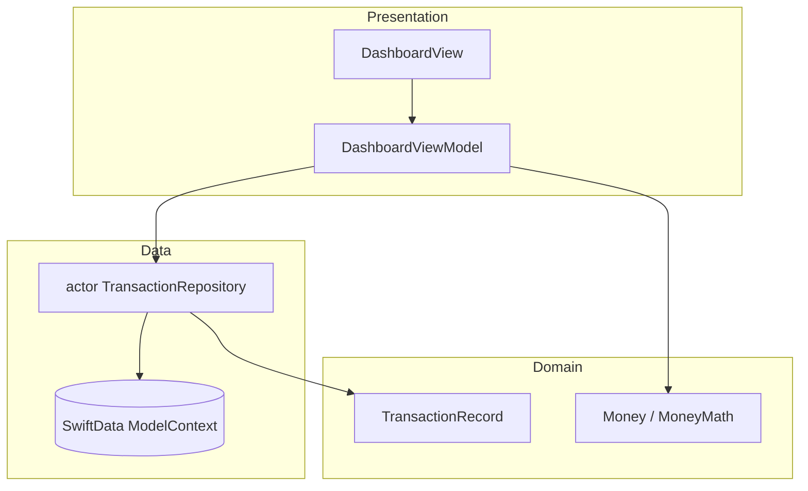

# PulseLedger

Personal finance dashboard — Clean Architecture, **SwiftData** offline-first cache, MVVM.

Revolut ships Core Data for the same goal: durable on-device state when the network is slow or unavailable. PulseLedger uses **SwiftData** with an **`actor TransactionRepository`** so reads/writes are serialized without blocking the main actor.

## Architecture

| Layer | Responsibility |
|-------|----------------|
| Presentation | SwiftUI + `@MainActor` view models |
| Domain | `Money`, transaction models |
| Data | `actor` repository, SwiftData persistence |

## Run

1. Open `PulseLedger.xcodeproj` in Xcode 15+
2. Select an iPhone simulator → Run (⌘R)
3. Tests: ⌘U

## Revolut-relevant signals

- Offline-first persistence (SwiftData)
- Swift Concurrency (`actor` repository)
- Fintech-style dashboard UI with accessibility labels

## Built with

Scaffolded with Cursor AI; architecture, concurrency patterns, and tests reviewed for clarity.

---
*Fintech-inspired UI — not affiliated with Revolut Ltd.*
