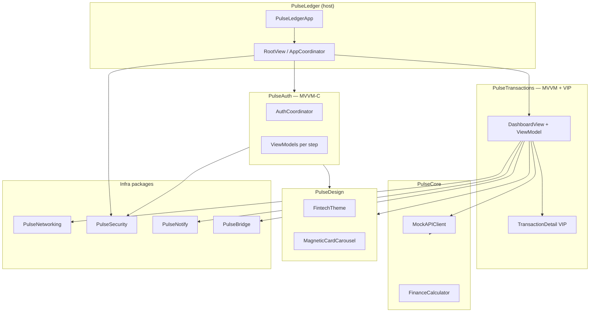

# PulseLedger

Flagship portfolio host app showcasing iOS architecture patterns through local Swift packages and a full mock neobank user journey.

## User journey

1. **Launch** → Welcome (login / signup)
2. **Auth (MVVM-C)** → Email → PIN (Keychain) → Face ID opt-in → Lottie success
3. **Biometric unlock** → `LAContext` gate when enabled
4. **Home (MVVM)** → Staggered mock API dashboard, magnetic card carousel, UIKit category chart
5. **Transaction detail (VIP)** → Tap any row for formatted detail
6. **Notifications** → Local alert on credit/income stream events

PulseLedger simulates a banking home API with **realistic latency, skeleton loading,** and incremental transaction streaming—balance
and weekly spend are derived from the ledger, with **Combine** for connectivity/streaming and **async/await for parallel endpoint fetches**.

## Architecture



## Packages

| Package | Responsibility |
|---------|----------------|
| **PulseCore** | `Money`, DTOs, `MockDataLoader`, `MockAPIClient`, `FinanceCalculator`, `mock_data.json` |
| **PulseDesign** | `FintechTheme`, skeletons, offline banner, magnetic carousel, animations, haptics |
| **PulseNetworking** | `NWPathMonitor` reachability + offline banner modifier |
| **PulseSecurity** | Keychain, `BiometricGate`, `AuthSessionStore`, Secure Enclave stub |
| **PulseNotify** | `PaymentNotificationCenter`, payment alert scheduling |
| **PulseBridge** | UIKit `CategoryBarChartView` + SwiftUI bridge |
| **PulseAuth** | Login/signup/PIN/biometrics — **MVVM-C** |
| **PulseTransactions** | Dashboard **MVVM**, transaction detail **VIP** |

## Patterns

| Pattern | Where | Notes |
|---------|-------|-------|
| **MVVM-C** | `PulseAuth` | `AuthCoordinator` drives `AuthFlowStep` |
| **MVVM** | `PulseTransactions` | `DashboardViewModel` + `DashboardView` |
| **VIP** | `TransactionDetailVIP` | Interactor → Presenter → View, Router builds screen |
| **Combine** | Dashboard | Offline publisher, transaction `PassthroughSubject` |
| **async/await** | `MockAPIClient`, VIP interactor | Staggered loads, detail fetch delay |

## Third-party dependencies

Only **[lottie-ios](https://github.com/airbnb/lottie-ios)** (via `PulseAuth`) for auth success animation.

## Build

```bash
xcodegen generate
xcodebuild -project PulseLedger.xcodeproj -scheme PulseLedger \
  -destination 'platform=iOS Simulator,name=iPhone 16e,OS=18.5' build
```

## CI

GitHub Actions workflow may need updating for local SPM packages and Lottie resolution — **fix pending**.

## Regenerate project

```bash
xcodegen generate
```
