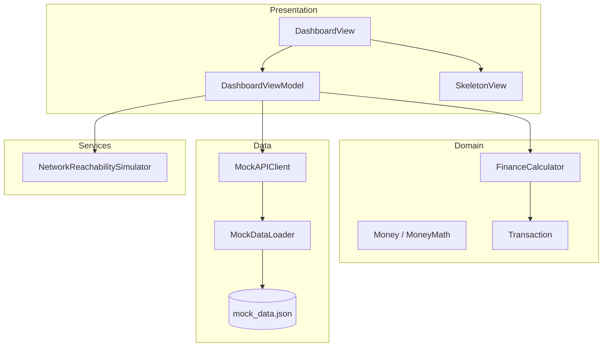

# PulseLedger

Personal finance dashboard — mock API, staggered loading, **Combine** + **async/await**, MVVM.

PulseLedger simulates a banking home API with **realistic latency, skeleton loading,** and incremental transaction streaming—balance
and weekly spend are derived from the ledger, with **Combine** for connectivity/streaming and **async/await for parallel endpoint fetches**.

## Architecture

| Layer | Responsibility |
|-------|----------------|
| Presentation | SwiftUI, skeletons, `@MainActor` view model |
| Domain | `Transaction`, `FinanceCalculator` (balance, weekly spend) |
| Data | DTOs, `MockDataLoader`, `MockAPIClient` (simulated endpoints) |
| Services | Offline simulation (`Combine` publisher) |

## Concurrency map

| Concern | Technology |
|---------|------------|
| Simulated HTTP delay (balance, weekly, transaction start) | **async/await** (`Task.sleep`, `MockAPIClient`) |
| Staggered transaction rows | **async/await** chunks + **Combine** `PassthroughSubject` → ViewModel sink |
| Offline banner toggle | **Combine** (`$isOffline` → `isOfflinePublisher`) |
| Parallel dashboard load | **async/await** `withTaskGroup` in `DashboardViewModel.load()` |
| UI updates | **MainActor** (`@MainActor` view model, `.receive(on: DispatchQueue.main)`) |

## Mock API behaviour

- Single file: `PulseLedger/Resources/mock_data.json` (accounts, categories, transactions).
- `MockDataLoader` decodes JSON once per call.
- `MockAPIClient` exposes three logical endpoints, each with a **1–2s** random delay:
  - `fetchBalance()` — computed from opening balance + all transactions
  - `fetchWeeklySpend()` — debits in the last 7 days
  - `streamTransactions(into:)` — emits **1–2** rows every **300–500ms** after initial delay
- Pull-to-refresh re-runs all endpoints.
- Toolbar menu: **Simulate offline** (blocks refresh/load).

## Run

1. `xcodegen generate` (if you changed `project.yml`)
2. Open `PulseLedger.xcodeproj` → iPhone simulator → Run (⌘R)
3. Tests: ⌘U

## Built with

Scaffolded with Cursor AI; mock API, loading UX, and tests reviewed for clarity.

---
*Fintech-inspired UI — not affiliated with Revolut Ltd.*
