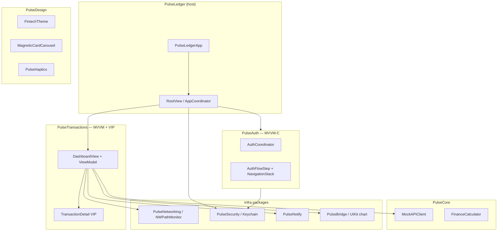

# PulseLedger

Flagship portfolio host app showcasing iOS architecture patterns through local Swift packages and a full mock neobank user journey.

## Highlights

| Area | Implementation |
|------|----------------|
| **Modularity** | Local SPM packages (`PulseCore`, `PulseDesign`, `PulseAuth`, …) |
| **Auth** | **MVVM-C** — `AuthCoordinator` + `NavigationStack` steps |
| **Home** | **MVVM** — `DashboardView` + `DashboardViewModel` |
| **Detail** | **VIP** — `TransactionDetailInteractor` → Presenter → View |
| **API** | Staggered mock client, Combine transaction stream, async parallel fetches |
| **Security** | Keychain session + PIN, `BiometricGate`, reinstall-safe `hasValidSession` |
| **Network** | `NWPathMonitor` offline banner (no fake toggle) |
| **Notifications** | Local payment alerts on credits + test/simulate actions |
| **UI** | UIKit category chart via `PulseBridge`, magnetic card carousel, Lottie success |
| **Polish** | Balance count-up, card snap haptics, skeleton loaders |

## User journey

1. **Launch** → Welcome (login / signup)
2. **Auth (MVVM-C)** → Email → PIN (4+ digits, Keychain) → optional Face ID → Lottie success (tap or 2s max)
3. **Biometric unlock** → `LAContext` gate when enabled (before dashboard)
4. **Home (MVVM)** → Staggered mock API dashboard, magnetic card carousel, UIKit category chart
5. **Transaction detail (VIP)** → Instant navigation from passed transaction model
6. **Notifications** → Local alert on credit/income; re-fire on pull-to-refresh

## Architecture



## Packages

| Package | Responsibility |
|---------|----------------|
| **PulseCore** | `Money`, DTOs, `MockDataLoader`, `MockAPIClient`, `FinanceCalculator`, `mock_data.json` |
| **PulseDesign** | `FintechTheme`, skeletons, offline banner, magnetic carousel, balance animation, haptics |
| **PulseNetworking** | `NWPathMonitor` reachability + offline banner modifier |
| **PulseSecurity** | Keychain, `BiometricGate`, `AuthSessionStore`, Secure Enclave stub |
| **PulseNotify** | `PaymentNotificationCenter`, payment alert scheduling |
| **PulseBridge** | UIKit `CategoryBarChartView` + SwiftUI bridge |
| **PulseAuth** | Login/signup/PIN/biometrics — **MVVM-C** |
| **PulseTransactions** | Dashboard **MVVM**, transaction detail **VIP** |

## Third-party dependencies

Only **[lottie-ios](https://github.com/airbnb/lottie-ios)** (via `PulseAuth`) for auth success animation.

## Build

```bash
# Remove stale SPM metadata if Xcode complains
rm -rf Packages/*/.swiftpm

xcodegen generate
xcodebuild -project PulseLedger.xcodeproj -scheme PulseLedger \
  -destination 'platform=iOS Simulator,name=iPhone 16e,OS=18.5' build
```

## Sanity testing

### Auth path

1. Fresh install or **Reset app state** (Settings → Developer, or **shake device in DEBUG**).
2. Welcome → **Log in** → email → PIN (4+ digits) → biometrics opt-in → success screen.
3. Tap success or wait ≤2s → dashboard (or biometric unlock first if enabled).

### Reinstall / session

1. Sign out from dashboard **Settings** (gear).
2. Delete app and reinstall — should land on auth, **not** dashboard.
3. Log in again; with biometrics enabled, cold launch should show **Unlock** before home.

### Offline / airplane mode

1. Open dashboard online (wifi icon in toolbar).
2. iOS **Settings → Airplane Mode** ON → return to app → **Offline — cached data** banner at top.
3. Turn airplane mode off → banner disappears.

### Notifications

1. Toolbar **bell.badge** → schedules a test payment notification.
2. Plain **bell** → requests notification permission.
3. Pull to refresh after load — latest **credit** transaction can re-trigger an alert.
4. Settings → **Simulate payment notification** for another test.

### Cards, balance, chart

1. Swipe card carousel — adjacent cards scale/fade; light haptic on snap.
2. Balance counts up ~0.8s when data loads.
3. Chart skeleton shows until transactions finish streaming, then UIKit bars appear.

### Transaction detail

Tap any row — detail should appear immediately (no artificial delay).

## Reset app state (testing)

- **Settings → Reset app state** — clears Keychain + notification UserDefaults, returns to auth.
- **DEBUG builds:** shake the device to reset instantly.

## CI

GitHub Actions workflow may need updating for local SPM packages and Lottie resolution — **fix pending**.

## Regenerate project

```bash
xcodegen generate
```
